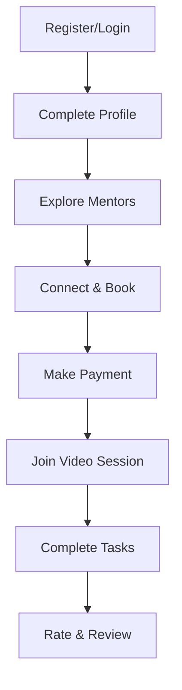
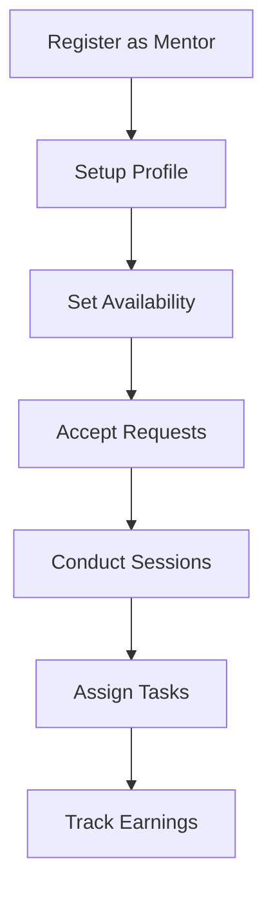

<div align="center">

<a href="#ment2be">
  
</a>


# Ment2Be

### 🎓 Connect. Learn. Grow.

**A modern mentorship platform that bridges the gap between aspiring students and industry experts**

[](https://ment2be.arshchouhan.me)
[](https://youtu.be/HM1EFZ8p1kQ)
[](https://github.com/arshchouhan/Ment2Be)

<br/>


<br/>


<br/>

[**🎯 Features**](#-features) · [**🛠️ Tech Stack**](#️-tech-stack) · [**🚀 Quick Start**](#-quick-start) · [**📸 Screenshots**](#-screenshots) · [**🤝 Contributing**](#-contributing)

</div>

---

## 🎯 Features

<table>
<tr>
<td width="50%" valign="top">

### 👨‍🎓 For Students

| Feature | Description |
|---------|-------------|
| 🔍 **Explore Mentors** | Browse by skills, expertise & ratings |
| 📅 **Book Sessions** | Schedule 1-on-1 video sessions |
| 💬 **Real-time Chat** | Instant messaging with mentors |
| 📝 **Task Tracking** | Manage assignments & goals |
| 📓 **Learning Journal** | Document your growth journey |
| ⭐ **Rate & Review** | Share feedback & video testimonials |
| 🏆 **Karma Points** | Earn rewards for engagement |

</td>
<td width="50%" valign="top">

### 👨‍🏫 For Mentors

| Feature | Description |
|---------|-------------|
| 📊 **Analytics Dashboard** | Track mentees & performance |
| 📆 **Availability** | Set your time slots |
| ✅ **Task Assignment** | Create tasks for mentees |
| 💰 **Earnings** | Monitor payments & revenue |
| 🌟 **Profile** | Showcase skills & rates |
| 💼 **Connections** | Manage student requests |
| 📈 **Reviews** | Build your reputation |

</td>
</tr>
</table>

### 🌟 Platform Highlights

<div align="center">

| 🎥 Video Conferencing | 💬 Real-time Chat | 🔐 Secure Auth | 💳 Payments |
|:---:|:---:|:---:|:---:|
| HD calls with ZegoCloud | Socket.IO messaging | JWT + Google OAuth | Razorpay integration |
| Screen sharing | Typing indicators | Role-based access | Secure transactions |
| In-call chat | Read receipts | Password recovery | Session booking |

</div>

---

## 🛠️ Tech Stack

<div align="center">

### Frontend


### Backend


### Services


</div>

---

## 🚀 Quick Start

### Prerequisites

```
✅ Node.js 18+
✅ MongoDB Atlas account
✅ Cloudinary account
✅ ZegoCloud account (for video)
```

### Installation

```bash
# 1. Clone the repository
git clone https://github.com/arshchouhan/Ment2Be.git
cd Ment2Be

# 2. Setup Backend
cd Backend
npm install
cp .env.example .env    # Configure your environment variables

# 3. Setup Frontend
cd ../Frontend
npm install
```

### Environment Variables

<details>
<summary><b>📋 Backend (.env)</b></summary>

```env
# Required
MONGO_URI=mongodb+srv://...
JWT_SECRET=your_secret_key
CLOUDINARY_CLOUD_NAME=your_cloud_name
CLOUDINARY_API_KEY=your_api_key
CLOUDINARY_API_SECRET=your_api_secret

# Optional
GOOGLE_CLIENT_ID=your_google_client_id
STREAM_API_KEY=your_stream_key
STREAM_API_SECRET=your_stream_secret
TWILIO_ACCOUNT_SID=your_twilio_sid
TWILIO_AUTH_TOKEN=your_twilio_token
GEMINI_API_KEY=your_gemini_key
```

</details>

<details>
<summary><b>📋 Frontend (.env.local)</b></summary>

```env
VITE_API_URL=http://localhost:4000
VITE_ZEGO_APP_ID=your_zego_app_id
VITE_ZEGO_SERVER_SECRET=your_zego_secret
```

</details>

### Run the Application

```bash
# Terminal 1: Backend (http://localhost:4000)
cd Backend && npm run dev

# Terminal 2: Frontend (http://localhost:5173)
cd Frontend && npm run dev
```

---

## 📁 Project Structure

```
Ment2Be/
│
├── 🔧 Backend/
│   ├── config/           # Database & service configs
│   ├── controllers/      # 23 request handlers
│   ├── middleware/       # Auth & validation
│   ├── models/           # 17 MongoDB schemas
│   ├── routes/           # 26 API route files
│   ├── services/         # Business logic
│   ├── socket/           # Real-time handlers
│   └── index.js          # Server entry
│
├── 🎨 Frontend/
│   └── src/
│       ├── assets/       # Images & static files
│       ├── components/   # 75+ UI components
│       ├── config/       # API configuration
│       ├── context/      # React providers
│       ├── pages/        # 38 page components
│       ├── services/     # API functions
│       └── App.jsx       # Root component
│
└── 📄 README.md
```

---

## 🔌 API Overview

<details>
<summary><b>View All Endpoints</b></summary>

| Category | Method | Endpoint | Description |
|----------|--------|----------|-------------|
| **Auth** | POST | `/api/auth/register` | Register user |
| | POST | `/api/auth/login` | Login |
| | POST | `/api/auth/google` | Google OAuth |
| **Users** | GET | `/api/user/me` | Get profile |
| | PUT | `/api/user/update` | Update profile |
| **Mentors** | GET | `/api/mentors` | List mentors |
| | GET | `/api/mentors/:id` | Get mentor |
| | PUT | `/api/mentors/profile` | Update profile |
| **Bookings** | POST | `/api/bookings` | Create booking |
| | GET | `/api/bookings` | Get bookings |
| | POST | `/api/bookings/:id/join` | Join session |
| **Messages** | GET | `/api/messages/conversations` | Get chats |
| | POST | `/api/messages/send` | Send message |
| **Tasks** | POST | `/api/tasks` | Create task |
| | GET | `/api/tasks` | Get tasks |
| | PUT | `/api/tasks/:id` | Update task |
| **Reviews** | POST | `/api/reviews` | Create review |
| | GET | `/api/reviews` | Get reviews |
| **Forum** | GET | `/api/forum/questions` | Get questions |
| | POST | `/api/forum/questions` | Ask question |

</details>

---

## 📸 Screenshots

<div align="center">

| Student Dashboard | Connect with Mentors |
|:---:|:---:|
|  |  |

| Task Management | Ask Questions |
|:---:|:---:|
|  |  |

| Student Features | Live Chat |
|:---:|:---:|
|  |  |

| Rate Your Mentor | Your Journal |
|:---:|:---:|
|  |  |

| Find Mentors | Your Mentees |
|:---:|:---:|
|  |  |

</div>

---

## 📊 User Flows

<table>
<tr>
<td width="50%">

### 👨‍🎓 Student Journey



</td>
<td width="50%">

### 👨‍🏫 Mentor Journey



</td>
</tr>
</table>

---

## 🤝 Contributing

We welcome contributions! Here's how you can help:

```bash
# 1. Fork the repository
# 2. Create your feature branch
git checkout -b feature/amazing-feature

# 3. Commit your changes
git commit -m 'Add amazing feature'

# 4. Push to the branch
git push origin feature/amazing-feature

# 5. Open a Pull Request
```

---

## 📞 Support

<div align="center">

| Resource | Link |
|----------|------|
| 🐛 **Report Bug** | [GitHub Issues](https://github.com/arshchouhan/Ment2Be/issues) |
| 💡 **Request Feature** | [GitHub Issues](https://github.com/arshchouhan/Ment2Be/issues) |
| 👨‍💻 **Author** | [Arsh Chauhan](https://github.com/arshchouhan) |

</div>

---

## 📄 License

This project is licensed under the [ISC License](https://opensource.org/licenses/ISC).

---

<div align="center">


### Made with ❤️ for the mentorship community


**[⬆ Back to Top](#ment2be)**

</div>
